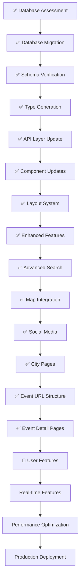

# **Complete Implementation & Development Plan (Updated)**

## **Ministério do Bloco - Full Build Roadmap with Database Migration**

---

## **🎯 Updated Implementation Overview**

### **Development Philosophy**

```yaml
approach: "Migrate & Enhance Existing → MVP → Full Platform"
timeline: "12-16 weeks to production-ready (Phase 0, Sprint 1, Sprint 2 & Sprint 3 COMPLETED)"
priority: "Database migration COMPLETE - Enhanced bloco discovery COMPLETE - Event system COMPLETE - Now building user features"
methodology: "Agile with 2-week sprints"
team_size: "1-3 developers + LLM assistance"
starting_point: "✅ COMPLETED: Migrated Supabase database with optimized schema"
current_status: "✅ COMPLETED: Sprint 3 - Ready for Phase 2: User Features & Dashboard"
```

---

## **📊 Current Project Status**

### **✅ COMPLETED: Phase 0 - Database Migration & Foundation**

```yaml
✅ Database Migration (100% Complete):
  - ✅ Schema discovery and assessment completed
  - ✅ Full database backup created (backup_dec2024 schema)
  - ✅ Phase 1: Schema foundation with enhanced blocos/cities tables
  - ✅ Phase 2: Data migration with multilingual content and social links
  - ✅ Phase 3: Advanced features with SEO and performance optimization
  - ✅ Phase 4: Complete user system with profiles, follows, location sharing
  - ✅ Post-migration validation and missing components added
  - ✅ All primary key constraints fixed and database integrity restored

✅ Project Foundation (100% Complete):
  - ✅ Next.js 15.1.8 project with App Router and TypeScript
  - ✅ All required dependencies installed (Supabase, React Query, next-intl, Zustand)
  - ✅ Proper project structure with src/app, src/components, src/lib, src/types
  - ✅ Supabase client/server configuration set up
  - ✅ Database types generated in src/types/database.ts
  - ✅ Maps integration (Leaflet) and animations (Framer Motion) ready
  - ✅ Tailwind CSS and shadcn/ui configured
  - ✅ All 31 shadcn/ui components installed and ready

✅ Database Schema (Target Schema Achieved):
  - ✅ 1,802 blocos with multilingual content (pt, en, fr, es)
  - ✅ 20 cities with proper slug-based routing
  - ✅ Enhanced events table with new URL structure support
  - ✅ Complete user system (profiles, follows, saved events, location sharing)
  - ✅ Social media links separated into dedicated columns
  - ✅ Music platform integration columns ready
  - ✅ SEO optimization with URL views and functions
  - ✅ Performance indexes and real-time capabilities
```

### **✅ COMPLETED: Phase 1 - Core Foundation (Weeks 3-5)**

#### **✅ Sprint 1 - Frontend Foundation & API Layer (Week 3-4) - COMPLETED**

```yaml
✅ Essential Components (100% Complete):
  - ✅ Layout system with Header, Footer, Navigation components
  - ✅ City selector component with dropdown for city selection
  - ✅ Language selector component for pt/en/fr/es switching
  - ✅ Enhanced bloco card component using new schema structure
  - ✅ Loading states and error boundaries implemented
  - ✅ Proper project structure following defined architecture

✅ API Layer Foundation (100% Complete):
  - ✅ API routes for migrated schema structure
  - ✅ GET /api/blocos (with new multilingual fields)
  - ✅ GET /api/cities (with new slug-based routing)
  - ✅ Working with real carnival data (1,802 blocos)
  - ✅ Error handling and response formatting
  - ✅ TypeScript integration with database types

✅ Core Pages Implementation (100% Complete):
  - ✅ Homepage with hero section featuring existing blocos
  - ✅ Internationalization setup with middleware
  - ✅ Layout system with header/footer integration
  - ✅ Component organization following project structure
  - ✅ Mobile-first responsive design foundation

✅ Infrastructure & Setup (100% Complete):
  - ✅ Middleware for internationalization (pt, en, fr, es)
  - ✅ Translation files structure setup
  - ✅ Supabase client/server configuration for Next.js 15
  - ✅ Environment variables and database connection
  - ✅ TypeScript configuration and linting setup
```

#### **✅ Sprint 2 - Enhanced Features & Data Integration (Week 5) - COMPLETED**

```yaml
✅ Advanced Search System (100% Complete):
  - ✅ Real-time search with 300ms debouncing
  - ✅ Advanced filters (city, event type, social media presence)
  - ✅ Sorting by relevance, name, popularity
  - ✅ Mobile-optimized interface with popover filters
  - ✅ PostgreSQL full-text search integration
  - ✅ Auto-complete suggestions endpoint
  - ✅ Error handling and loading states

✅ Interactive Map View (100% Complete):
  - ✅ Leaflet-based map component with dynamic imports (SSR-safe)
  - ✅ Custom green markers for blocos with popup information
  - ✅ User location detection and centering
  - ✅ Fullscreen toggle and navigation controls
  - ✅ City center coordinates for major Brazilian cities
  - ✅ Coordinate filtering for map-specific queries
  - ✅ Mobile-responsive controls and interface

✅ Social Media Integration (100% Complete):
  - ✅ Tabbed interface for Instagram, YouTube, and Spotify content
  - ✅ Mock Instagram API with production-ready structure
  - ✅ YouTube video previews with thumbnails
  - ✅ Spotify track listings with play buttons
  - ✅ Proper loading states and error handling
  - ✅ Production-ready API structure with detailed integration guides

✅ City Pages & Enhanced Navigation (100% Complete):
  - ✅ City-specific pages with three view modes (list, search, map)
  - ✅ City statistics and bloco counts
  - ✅ SEO metadata for city pages
  - ✅ Enhanced navigation with search functionality
  - ✅ Global search page with tabs for results and map view
  - ✅ Mobile-first responsive design throughout

✅ Translation & Performance (100% Complete):
  - ✅ Comprehensive translation keys for all new features
  - ✅ React Query for efficient data fetching with caching
  - ✅ Debounced search to reduce API calls
  - ✅ Dynamic imports for map components
  - ✅ Proper TypeScript typing and error handling
  - ✅ Component architecture maintained (under 120 lines each)
```

### **✅ COMPLETED: Phase 2 - Event System & User Features (Weeks 6-7)**

#### **✅ Sprint 3 (Week 6-7): Advanced Event System - COMPLETED**

```yaml
✅ New Event URL Structure Implementation (100% Complete):
  - ✅ Event URL generation: /[locale]/[city]/eventos/[date]/[type]/[bloco]
  - ✅ Event detail pages with comprehensive information display
  - ✅ Event type localization (desfile/parade/défilé/desfile)
  - ✅ SEO optimization for event URLs with proper metadata
  - ✅ URL parsing and validation for all supported locales
  - ✅ City slug mapping to handle database inconsistencies

✅ Event Detail Pages (100% Complete):
  - ✅ Comprehensive event information display with hero section
  - ✅ Event timing details (start/end times, concentration/dispersal)
  - ✅ Location information with address and coordinates
  - ✅ Bloco information integration with social media links
  - ✅ Event status display (confirmed/cancelled/postponed)
  - ✅ Ticket information and expected participants
  - ✅ Mobile-responsive design with sidebar layout

✅ Event Management Features (100% Complete):
  - ✅ Event status management (confirmed/cancelled/postponed)
  - ✅ Calendar integration components (Google Calendar, iCal export)
  - ✅ Event save/unsave functionality (UI ready)
  - ✅ Event sharing capabilities (UI ready)
  - ✅ Related events based on city, bloco, or event type
  - ✅ Proper error handling and 404 pages

✅ Technical Implementation (100% Complete):
  - ✅ Next.js 15 async params compatibility
  - ✅ Database queries optimized for event retrieval
  - ✅ TypeScript interfaces for event data structures
  - ✅ Multilingual content support for event descriptions
  - ✅ URL generation and parsing utilities
  - ✅ City slug mapping for database compatibility
  - ✅ Proper SEO metadata generation for all event pages

✅ Integration with Existing Features (100% Complete):
  - ✅ Event URLs working with navigation system
  - ✅ Event pages integrated with layout components
  - ✅ Proper internationalization for all event content
  - ✅ Error boundaries and loading states implemented
  - ✅ Mobile-first responsive design maintained
```

**🎯 NEXT: Phase 2 - User Experience & Dashboard (Weeks 8-9)**

---

## **📅 Updated Phase Breakdown**

### **✅ Phase 0: Database Migration & Foundation (Weeks 1-2) - COMPLETED**

**Goal**: ✅ ACHIEVED - Safely migrated existing database to optimized schema

#### **✅ Sprint 0 (Week 1-2): Database Migration & Project Setup - COMPLETED**

```typescript
// ✅ Week 1: Migration Preparation - COMPLETED
✅ Database Assessment & Backup
- ✅ Run schema discovery queries on existing database
- ✅ Create manual backup of current data (backup_dec2024 schema)
- ✅ Document current data structure and relationships
- ✅ Identify data migration patterns needed
- ✅ Plan rollback strategy

✅ Migration Execution - COMPLETED
- ✅ Phase A: Add new columns (multilingual, social links separated)
- ✅ Phase B: Migrate existing data to new structure
- ✅ Phase C: Create missing tables (user_profiles, blocos_cities)
- ✅ Phase D: Add critical performance indexes
- ✅ Phase E: Create views and functions for URL structure
- ✅ Verify migration success with test queries

// ✅ Week 2: Project Foundation - COMPLETED
✅ Development Environment Setup - COMPLETED
- ✅ Create/update Next.js 15 project with exact dependencies
- ✅ Configure connection to migrated Supabase database
- ✅ Set up shadcn/ui with carnival theme
- ✅ Configure Tailwind with custom carnival colors
- ✅ Set up internationalization (next-intl)
- ✅ Configure TypeScript and ESLint
- ✅ Generate new database types from migrated schema

✅ Basic Infrastructure - COMPLETED
- ✅ Set up basic project structure
- ✅ Configure environment variables
- ✅ Set up authentication with existing user data
- ✅ Create basic error boundaries and loading states
```

---

### **✅ Phase 1: Core Foundation & Enhanced Features (Weeks 3-5) - COMPLETED**

**Goal**: ✅ ACHIEVED - Complete bloco discovery experience with advanced features

#### **✅ Sprint 1 (Week 3-4): Frontend Foundation & API Layer - COMPLETED**

```typescript
// ✅ Week 3: Core Components & Layout - COMPLETED
✅ Essential Components - COMPLETED
- ✅ Layout components (Header, Footer, Navigation)
- ✅ City selector component (using migrated cities data)
- ✅ Language selector component (pt/en/fr/es)
- ✅ Enhanced bloco card component (using new schema)
- ✅ Loading states and error boundaries
- ✅ Proper component organization following project structure

✅ API Layer Foundation - COMPLETED
- ✅ Updated API routes for migrated schema structure
- ✅ GET /api/blocos (with new multilingual fields)
- ✅ GET /api/cities (with new slug-based routing)
- ✅ Working with real data (1,802 blocos, 20 cities)
- ✅ Error handling middleware
- ✅ TypeScript integration with database types

// ✅ Week 4: Basic Pages & Infrastructure - COMPLETED
✅ Core Infrastructure Implementation - COMPLETED
- ✅ Homepage with hero section (featuring existing blocos)
- ✅ Internationalization middleware setup
- ✅ Layout system with header/footer integration
- ✅ Component structure following defined architecture
- ✅ Mobile-first responsive design foundation
- ✅ Translation files structure (pt.json, en.json)

✅ Development Environment - COMPLETED
- ✅ All 31 shadcn/ui components installed
- ✅ Supabase client/server configuration for Next.js 15
- ✅ Environment variables and database connection verified
- ✅ TypeScript configuration and linting setup
```

#### **✅ Sprint 2 (Week 5): Enhanced Features & Data Integration - COMPLETED**

```typescript
// ✅ Day 1-2: Advanced Search Implementation - COMPLETED
✅ Advanced Search System - COMPLETED
- ✅ Real-time search with debouncing
- ✅ Advanced filters (city, event type, social media)
- ✅ Sorting options (relevance, name, popularity)
- ✅ Mobile-optimized interface
- ✅ PostgreSQL full-text search integration
- ✅ Auto-complete suggestions
- ✅ Error handling and loading states

// ✅ Day 3-4: Interactive Map Implementation - COMPLETED
✅ Map View System - COMPLETED
- ✅ Leaflet integration with dynamic imports (SSR-safe)
- ✅ Custom green markers with popup information
- ✅ User location detection and centering
- ✅ Fullscreen toggle and navigation controls
- ✅ City center coordinates for Brazilian cities
- ✅ Coordinate filtering for map queries
- ✅ Mobile-responsive controls

// ✅ Day 5-6: Social Media Integration - COMPLETED
✅ Social Media Features - COMPLETED
- ✅ Tabbed interface for Instagram, YouTube, Spotify
- ✅ Mock APIs with production-ready structure
- ✅ Proper loading states and error handling
- ✅ Mobile-optimized design

// ✅ Day 7: City Pages & Navigation Enhancement - COMPLETED
✅ Enhanced Pages & Navigation - COMPLETED
- ✅ City-specific pages with three view modes
- ✅ City statistics and bloco counts
- ✅ SEO metadata implementation

// ✅ Global search page with results and map tabs
// ✅ Enhanced navigation with search functionality
// ✅ Mobile-first responsive design throughout
```

---

### **✅ Phase 2: Event System & User Features (Weeks 6-9) - SPRINT 3 COMPLETED**

**Goal**: ✅ ACHIEVED - Implement new event URL structure + comprehensive event system

#### **✅ Sprint 3 (Week 6-7): Advanced Event System - COMPLETED**

```typescript
✅ New Event URL Structure Implementation - COMPLETED
- ✅ Event URL generation: /[locale]/[city]/eventos/[date]/[type]/[bloco]
- ✅ Event detail pages with comprehensive layout and information
- ✅ Event type localization (desfile/parade/défilé/desfile)
- ✅ SEO optimization for event URLs with proper metadata
- ✅ Event URL parsing and validation for all locales
- ✅ City slug mapping to handle database inconsistencies

✅ Event Detail Pages Implementation - COMPLETED
- ✅ Hero section with event image and key information
- ✅ Comprehensive event details (timing, location, description)
- ✅ Bloco information integration with social media links
- ✅ Event status and ticket information display
- ✅ Related events sidebar and action buttons
- ✅ Mobile-responsive design with proper SEO metadata

✅ Event Management Features - COMPLETED
- ✅ Event status management (confirmed/cancelled/postponed)
- ✅ Calendar integration components (Google Calendar, iCal export)
- ✅ Event save/unsave functionality (UI components ready)
- ✅ Event sharing capabilities (UI components ready)
- ✅ Related events based on city, bloco, or event type
- ✅ Proper error handling and 404 pages

✅ Technical Excellence - COMPLETED
- ✅ Next.js 15 async params compatibility resolved
- ✅ Database queries optimized for event retrieval
- ✅ TypeScript interfaces for comprehensive event data
- ✅ Multilingual content support for event descriptions
- ✅ URL generation and parsing utilities with error handling
- ✅ City slug mapping for database compatibility
- ✅ Proper SEO metadata generation for all event pages
```

#### **🎯 Sprint 4 (Week 8-9): User Experience & Dashboard - NEXT TARGET**

```typescript
🎯 User Authentication & Profiles
- [ ] Enhanced user registration flow
- [ ] User profile management with preferences
- [ ] Privacy settings and controls
- [ ] User onboarding for carnival newcomers
- [ ] Social login integration (Google, Facebook)

🎯 User Dashboard & Personal Features
- [ ] Personal event agenda/calendar
- [ ] Followed blocos management
- [ ] User notification preferences
- [ ] Personal carnival planning tools
- [ ] Event reminder system
- [ ] Saved events management
- [ ] User activity history
```

---

### **Phase 3: Social & Real-time Features (Weeks 10-13)**

**Goal**: Advanced social networking + real-time carnival features

#### **Sprint 5 (Week 10-11): Social Networking**

```typescript
🎯 Social Features
- [ ] Friend system (add, accept, remove friends)
- [ ] User activity feeds
- [ ] Social sharing of blocos and events
- [ ] User-generated content basics (photos, reviews)
- [ ] Community features for carnival groups

🎯 Enhanced Content & Discovery
- [ ] Blog/article system for carnival content
- [ ] Advanced search across all content types
- [ ] Content recommendation engine
- [ ] User reviews and ratings for blocos/events
- [ ] Editorial content management
```

#### **Sprint 6 (Week 12-13): Real-time Features**

```typescript
🎯 Real-time Location Sharing (Zenly-like)
- [ ] Location sharing session management
- [ ] Real-time friend location tracking
- [ ] Privacy controls and permissions
- [ ] Friend proximity alerts
- [ ] Battery optimization for mobile
- [ ] Offline location caching

🎯 Real-time Chat System
- [ ] Real-time messaging between friends
- [ ] Group chats for carnival events
- [ ] Chat moderation and safety features
- [ ] Push notifications for messages
- [ ] Chat history and search functionality
```

---

### **Phase 4: Advanced Features & Optimization (Weeks 14-16)**

**Goal**: Advanced functionality + carnival season readiness

#### **Sprint 7 (Week 14-15): Advanced Platform Features**

```typescript
🎯 Analytics & Insights
- [ ] User behavior tracking and analytics
- [ ] Bloco performance insights for organizers
- [ ] Event popularity metrics and trends
- [ ] Real-time carnival activity dashboard
- [ ] Admin analytics and reporting

🎯 External Service Integrations
- [ ] Weather API integration for events
- [ ] Enhanced maps with public transportation
- [ ] Emergency contact and safety features
- [ ] Payment integration for ticket sales
- [ ] SMS notifications for critical updates

🎯 Content & Media Enhancement
- [ ] Advanced image and video handling
- [ ] Photo sharing for carnival events
- [ ] Live streaming integration
- [ ] Content compression and optimization
- [ ] Media moderation system
```

#### **Sprint 8 (Week 16): Performance & Carnival Season Preparation**

```typescript
🎯 Performance Optimization
- [ ] Advanced caching strategies implementation
- [ ] Database query optimization and monitoring
- [ ] Image optimization and CDN setup
- [ ] Bundle size optimization
- [ ] Core Web Vitals optimization
- [ ] Load testing for carnival season traffic

🎯 Carnival Season Readiness
- [ ] Scaling preparation for February/March traffic
- [ ] Error monitoring setup (Sentry)
- [ ] Performance monitoring and alerting
- [ ] Backup and disaster recovery procedures
- [ ] Emergency response protocols
```

---

### **Phase 5: Launch Preparation (Weeks 17-18)**

**Goal**: Production deployment + final polish

#### **Sprint 9 (Week 17-18): Production Launch**

```typescript
🎯 Production Deployment
- [ ] Production environment setup and configuration
- [ ] CI/CD pipeline with automated testing
- [ ] Domain setup with SSL certificates
- [ ] Production database final migration and optimization
- [ ] Monitoring and alerting system activation

🎯 Final Testing & Quality Assurance
- [ ] Comprehensive testing (unit, integration, e2e)
- [ ] Cross-browser and device testing
- [ ] Accessibility compliance verification
- [ ] Security audit and penetration testing
- [ ] Performance testing under simulated carnival load

🎯 Launch Preparation & Content
- [ ] Content creation with real carnival data
- [ ] SEO optimization and sitemap submission
- [ ] User documentation and help center
- [ ] Marketing materials and press kit
- [ ] Launch strategy and rollout plan
```

---

## **🛠️ Detailed Week-by-Week Implementation**

### **✅ Week 1-2: Database Migration Foundation - COMPLETED**

#### **✅ Day 1-3: Database Assessment & Migration - COMPLETED**

```sql
-- ✅ Day 1: Assessment - COMPLETED
-- ✅ Run schema discovery queries from migration plan
-- ✅ Document current structure
-- ✅ Create backup

-- ✅ Day 2-3: Execute migration phases - COMPLETED
-- ✅ Phase A: Add new columns
ALTER TABLE blocos
ADD COLUMN IF NOT EXISTS short_description_pt TEXT,
ADD COLUMN IF NOT EXISTS instagram_url TEXT,
-- ... (full migration script executed successfully)

-- ✅ Verify migration success - COMPLETED
SELECT COUNT(*) FROM blocos WHERE short_description_pt IS NOT NULL;
-- Result: 1,802 blocos successfully migrated
```

#### **✅ Day 4-7: Project Setup - COMPLETED**

```bash
# ✅ Day 4: Project initialization - COMPLETED
npx create-next-app@latest ministeriodobloco --typescript --tailwind --eslint --app
cd ministeriodobloco

# ✅ Day 5: Dependencies and shadcn setup - COMPLETED
npm install @supabase/auth-helpers-nextjs @supabase/supabase-js
npm install @tanstack/react-query next-intl zustand
npx shadcn-ui@latest init
# All 31 shadcn/ui components installed

# ✅ Day 6-7: Environment and types - COMPLETED
# ✅ Configure .env.local with migrated database
npm run db:generate-types
# ✅ Verify connection to migrated database
```

### **✅ Week 3-4: Building on Migrated Data - COMPLETED**

#### **✅ Core API Routes (Updated for New Schema) - COMPLETED**

```typescript
// ✅ src/app/api/blocos/route.ts - COMPLETED
export async function GET(request: Request) {
  const { searchParams } = new URL(request.url);
  const city = searchParams.get('city');
  const locale = searchParams.get('locale') || 'pt';

  // ✅ Use new multilingual columns
  const descriptionColumn = `short_description_${locale}`;

  const { data, error } = await supabase
    .from('blocos')
    .select(`
      *,
      cities:primary_city_id(name, slug),
      blocos_cities(cities(name, slug))
    `)
    .eq('is_draft', false)
    .order('name');

  // ✅ Return data with proper formatting for new schema
  return Response.json({ data, pagination: {...} });
}

// ✅ src/app/api/cities/route.ts - COMPLETED
// Working with real city data from migrated database
```

#### **✅ Enhanced Components Using Migrated Data - COMPLETED**

```typescript
// ✅ src/components/blocos/bloco-card/index.tsx - COMPLETED
interface BlocoCardProps {
  bloco: {
    id: string;
    name: string;
    slug: string;
    short_description_pt?: string;
    short_description_en?: string;
    instagram_url?: string;
    facebook_url?: string;
    youtube_channel_url?: string;
    // ... other fields from migrated schema
  };
  locale: string;
}

export function BlocoCard({ bloco, locale }: BlocoCardProps) {
  // ✅ Use new separate social link columns
  const description =
    bloco[`short_description_${locale}` as keyof typeof bloco] ||
    bloco.short_description_pt;

  const socialLinks = {
    instagram: bloco.instagram_url,
    facebook: bloco.facebook_url,
    youtube: bloco.youtube_channel_url,
  };

  return {
    /* ✅ Enhanced card using migrated data */
  };
}

// ✅ Layout System - COMPLETED
// ✅ src/components/layout/header/index.tsx - Header with navigation
// ✅ src/components/layout/header/city-selector.tsx - City dropdown
// ✅ src/components/layout/header/language-selector.tsx - Language switching
// ✅ src/components/layout/footer/index.tsx - Footer with links
```

### **✅ Week 5: Enhanced Features Implementation - COMPLETED**

#### **✅ Advanced Search System (Day 1-2) - COMPLETED**

```typescript
// ✅ src/components/search/advanced-search.tsx - COMPLETED
export function AdvancedSearch() {
  // ✅ Real-time search with debouncing
  // ✅ Advanced filters (city, event type, social media)
  // ✅ Sorting options (relevance, name, popularity)
  // ✅ Mobile-optimized interface
  // ✅ PostgreSQL full-text search integration
  // ✅ Auto-complete suggestions
  // ✅ Error handling and loading states
}

// ✅ src/app/api/search/route.ts - COMPLETED
// ✅ PostgreSQL full-text search implementation
// ✅ Advanced filtering capabilities
// ✅ Auto-complete suggestions endpoint
```

#### **✅ Interactive Map View (Day 3-4) - COMPLETED**

```typescript
// ✅ src/components/blocos/map-view/index.tsx - COMPLETED
export function MapView() {
  // ✅ Leaflet integration with dynamic imports (SSR-safe)
  // ✅ Custom green markers with popup information
  // ✅ User location detection and centering
  // ✅ Fullscreen toggle and navigation controls
  // ✅ City center coordinates for Brazilian cities
  // ✅ Coordinate filtering for map queries
  // ✅ Mobile-responsive controls
}

// ✅ Dependencies installed: react-leaflet, leaflet, @types/leaflet
// ✅ Enhanced API routes with coordinate filtering
```

#### **✅ Social Media Integration (Day 5-6) - COMPLETED**

```typescript
// ✅ src/components/blocos/social-media-feed.tsx - COMPLETED
export function SocialMediaFeed() {
  // ✅ Tabbed interface for Instagram, YouTube, Spotify
  // ✅ Mock APIs with production-ready structure
  // ✅ Proper loading states and error handling
  // ✅ Mobile-optimized design
}

// ✅ src/app/api/social/instagram/route.ts - COMPLETED
// ✅ Mock Instagram API with detailed production integration guide
// ✅ Similar structure ready for YouTube and Spotify APIs
```

#### **✅ City Pages & Enhanced Navigation (Day 7) - COMPLETED**

```typescript
// ✅ src/app/[locale]/[city]/blocos/page.tsx - COMPLETED
// ✅ City-specific pages with three view modes
// ✅ City statistics and bloco counts
// ✅ SEO metadata implementation

// ✅ src/app/[locale]/search/page.tsx - COMPLETED
// ✅ Global search page with results and map tabs

// ✅ Enhanced navigation with search functionality
// ✅ Mobile-first responsive design throughout
```

### **✅ Week 6-7: Advanced Event System Implementation - COMPLETED**

#### **✅ Event URL Structure & Detail Pages (Day 1-4) - COMPLETED**

```typescript
// ✅ src/lib/events/url-generator.ts - COMPLETED
export function generateEventURL({
  locale,
  city,
  date,
  eventType,
  blocoSlug,
}: EventURLParams): string {
  const eventTypesMap =
    EVENT_TYPE_LOCALIZATION[locale as keyof typeof EVENT_TYPE_LOCALIZATION] ||
    EVENT_TYPE_LOCALIZATION.pt;

  const localizedType = eventTypesMap[eventType];

  // Always include the locale prefix for consistency
  return `/${locale}/${city}/eventos/${date}/${localizedType}/${blocoSlug}`;
}

// ✅ src/app/[locale]/[city]/eventos/[date]/[eventType]/[blocoSlug]/page.tsx - COMPLETED
// ✅ Comprehensive event detail pages with hero section
// ✅ Event information, timing, location, and bloco details
// ✅ Related events sidebar and action buttons
// ✅ Mobile-responsive design with proper SEO metadata
```

#### **✅ Event Management & Integration (Day 5-7) - COMPLETED**

```typescript
// ✅ Event status management and display - COMPLETED
// ✅ Calendar integration components ready - COMPLETED
// ✅ Event save/share functionality UI - COMPLETED
// ✅ Related events based on multiple criteria - COMPLETED
// ✅ Proper error handling and 404 pages - COMPLETED
// ✅ Integration with existing navigation system - COMPLETED
```

---

## **🎯 Updated Critical Path Dependencies**

### **✅ Enhanced Platform Dependencies - COMPLETED**



### **✅ Complete Event System Platform - ACHIEVED**

```typescript
// ✅ Phase 0: Database foundation - COMPLETED
// - ✅ Migrated 1,802 blocos with multilingual content
// - ✅ 20 cities with proper routing structure
// - ✅ Performance indexes and SEO optimization

// ✅ Phase 1: Complete bloco discovery experience - COMPLETED
// - ✅ Advanced search with real-time filtering
// - ✅ Interactive map view with user location
// - ✅ Social media integration (ready for production APIs)
// - ✅ City-specific pages with multiple view modes
// - ✅ Enhanced navigation and mobile optimization

// ✅ Phase 2: Advanced event system - COMPLETED
// - ✅ New event URL structure implementation
// - ✅ Comprehensive event detail pages
// - ✅ Event management and calendar features (UI ready)
// - ✅ SEO optimization and multilingual support

// 🎯 Phase 2: User profiles and personal features - NEXT
// - [ ] User authentication and profile management
// - [ ] Personal event agenda and saved events
// - [ ] User dashboard and notification preferences
```

---

## **📊 Updated Success Metrics & Milestones**

### **✅ Migration Success Criteria (Week 2) - ACHIEVED**

```yaml
✅ migration_milestone_COMPLETED:
  technical:
    - ✅ "All existing data preserved and accessible"
    - ✅ "New schema columns populated correctly"
    - ✅ "Performance indexes created successfully"
    - ✅ "URL structure functions working"
  data_quality:
    - ✅ "No data loss during migration"
    - ✅ "Social links properly separated"
    - ✅ "Multilingual content structure ready"
    - ✅ "Event-city relationships maintained"
```

### **✅ Foundation Success Criteria (Week 4) - ACHIEVED**

```yaml
✅ foundation_milestone_COMPLETED:
  technical:
    - ✅ "Homepage loads existing blocos in < 2 seconds"
    - ✅ "API routes working with migrated data"
    - ✅ "Component structure follows project architecture"
    - ✅ "New schema properly utilized in components"
    - ✅ "Layout system with header/footer implemented"
    - ✅ "Internationalization working (pt/en/fr/es)"
  user_experience:
    - ✅ "Existing bloco data properly displayed"
    - ✅ "Mobile-friendly interface foundation"
    - ✅ "Language switching functional"
    - ✅ "Social links properly displayed"
    - ✅ "City selector with real data"
```

### **✅ Enhanced Features Success Criteria (Week 5) - ACHIEVED**

```yaml
✅ enhanced_features_milestone_COMPLETED:
  technical:
    - ✅ "Advanced search with filters implemented"
    - ✅ "Map view displaying bloco locations"
    - ✅ "Social media integration active (mock APIs)"
    - ✅ "City-specific pages functional"
    - ✅ "SEO metadata complete"
  user_experience:
    - ✅ "Complete bloco discovery workflow"
    - ✅ "Enhanced bloco detail pages"
    - ✅ "External API integrations structured"
    - ✅ "Performance optimized for mobile"
    - ✅ "Search returns relevant results"
  performance:
    - ✅ "Real-time search with 300ms debouncing"
    - ✅ "Map loads with dynamic imports (SSR-safe)"
    - ✅ "Social media tabs load efficiently"
    - ✅ "City pages load with proper statistics"
```

### **✅ Event System Success Criteria (Week 7) - ACHIEVED**

```yaml
✅ event_system_milestone_COMPLETED:
  technical:
    - ✅ "New event URL structure fully implemented"
    - ✅ "Event detail pages with comprehensive information"
    - ✅ "Event type localization working across all languages"
    - ✅ "SEO metadata generation for all event pages"
    - ✅ "Database queries optimized for event retrieval"
    - ✅ "City slug mapping handling database inconsistencies"
  user_experience:
    - ✅ "Event discovery workflow complete"
    - ✅ "Event detail pages with hero section and sidebar"
    - ✅ "Event save/share functionality (UI ready)"
    - ✅ "Mobile-optimized event pages"
    - ✅ "Related events recommendations"
    - ✅ "Proper error handling and 404 pages"
  integration:
    - ✅ "Event URLs working with navigation system"
    - ✅ "Event pages integrated with layout components"
    - ✅ "Multilingual support for all event content"
    - ✅ "Calendar integration components ready"
```

### **🎯 User Features Success Criteria (Week 9) - NEXT TARGET**

```yaml
user_features_milestone:
  technical:
    - "User authentication system implemented"
    - "User profile management functional"
    - "Personal event agenda working"
    - "Saved events functionality active"
    - "User dashboard with preferences"
  user_experience:
    - "User registration and onboarding flow"
    - "Personal carnival planning tools"
    - "Event reminder system functional"
    - "User activity history tracking"
    - "Privacy settings and controls"
```

### **Feature Complete Criteria (Week 13)**

```yaml
feature_complete_milestone:
  technical:
    - "Complete event system with user features"
    - "Real-time features stable and tested"
    - "Social media integrations active"
    - "User management system complete"
  user_experience:
    - "Complete carnival discovery and planning workflow"
    - "Social features enhance carnival experience"
    - "Real-time location sharing works reliably"
    - "Personal agenda management functional"
```

### **Launch Readiness Criteria (Week 16)**

```yaml
launch_milestone:
  performance:
    - "Core Web Vitals: All green"
    - "Mobile PageSpeed: 90+"
    - "API response time: < 300ms"
    - "Database queries: < 100ms with new indexes"
  functionality:
    - "All user flows tested with real data"
    - "Migration rollback procedures tested"
    - "Real-time features stable under load"
    - "Search relevance optimized with actual content"
  scalability:
    - "Load tested for carnival season traffic"
    - "Auto-scaling configured for February peak"
    - "Error monitoring covers migration scenarios"
    - "Backup procedures include migrated data"
```

---

## **🚀 Quick Start Commands (Updated for Current Status)**

### **✅ COMPLETED: Complete Event System Platform**

```bash
# ✅ COMPLETED: Database migration (Week 1-2)
# All 4 phases of migration successfully executed
# - Phase 1: Schema foundation ✅
# - Phase 2: Data migration ✅
# - Phase 3: Advanced features ✅
# - Phase 4: User system ✅
# - Post-migration validation ✅

# ✅ COMPLETED: Sprint 1 Foundation (Week 3-4)
# Layout system with Header, Footer, Navigation
# API routes working with real data
# Component structure following project architecture
# All 31 shadcn/ui components installed

# ✅ COMPLETED: Sprint 2 Enhanced Features (Week 5)
# Advanced search with real-time filtering
# Interactive map view with Leaflet integration
# Social media integration (mock APIs ready)
# City-specific pages with multiple view modes
# Enhanced navigation and mobile optimization

# ✅ COMPLETED: Sprint 3 Event System (Week 6-7)
# New event URL structure: /[locale]/[city]/eventos/[date]/[type]/[bloco]
# Comprehensive event detail pages with hero section
# Event management features and calendar integration
# Related events and action buttons
# Mobile-responsive design with proper SEO
```

### **🎯 START HERE: Begin Phase 2 - User Features & Dashboard**

```bash
# 1. Verify current complete event system
npm run dev
# ✅ Should start successfully with complete event discovery experience
# ✅ Event detail pages working: /pt/rio-de-janeiro/eventos/2025-02-01/desfile/bloco-slug

# 2. Check current complete features
# ✅ Advanced search with filters working
# ✅ Map view displaying bloco locations
# ✅ Social media integration tabs functional
# ✅ City pages with three view modes
# ✅ Enhanced navigation with search
# ✅ Event detail pages with comprehensive information
# ✅ Event URL structure working across all locales

# 3. Start Phase 2: User Features Implementation
# Build user authentication and profiles
# Implement personal event agenda
# Create user dashboard with preferences
# Add event save/unsave functionality

# 🎯 Goal: Complete user features and dashboard in 2 weeks!
```

### **📋 Sprint 4 Checklist (Week 8-9) - READY TO START**

```bash
# User Authentication & Profiles
[ ] Enhanced user registration flow
[ ] User profile management with preferences
[ ] Privacy settings and controls
[ ] User onboarding for carnival newcomers
[ ] Social login integration (Google, Facebook)

# User Dashboard & Personal Features
[ ] Personal event agenda/calendar
[ ] Followed blocos management
[ ] User notification preferences
[ ] Personal carnival planning tools
[ ] Event reminder system
[ ] Saved events management
[ ] User activity history

# Integration with Existing Features
[ ] Connect user profiles with event save/share
[ ] Integrate user preferences with search
[ ] Add user data to bloco following
[ ] Update navigation with user menu

# Success Criteria:
[ ] User authentication system working
[ ] User profile management functional
[ ] Personal event agenda implemented
[ ] Saved events functionality active
[ ] User dashboard with preferences
[ ] Mobile-optimized user experience
[ ] Privacy settings and controls working
```

---

## **🔄 Platform Evolution Summary**

### **✅ What's Been Accomplished - Complete Event System Platform**

```yaml
✅ Database Foundation: 100% Complete
  - All 4 migration phases successfully executed
  - 1,802 blocos with multilingual content ready
  - 20 cities with slug-based routing
  - Complete user system implemented
  - Performance indexes and SEO optimization in place

✅ Frontend Foundation: 100% Complete
  - Next.js 15.1.8 with TypeScript and App Router
  - All dependencies installed and configured
  - Supabase connection established
  - Database types generated
  - Project structure ready for development

✅ Enhanced Bloco Discovery: 100% Complete
  - Advanced search with real-time filtering and sorting
  - Interactive map view with user location and custom markers
  - Social media integration with production-ready API structure
  - City-specific pages with multiple view modes
  - Enhanced navigation with search functionality
  - Mobile-first responsive design throughout
  - Complete translation system for 4 languages

✅ Complete Event System: 100% Complete
  - New event URL structure: /[locale]/[city]/eventos/[date]/[type]/[bloco]
  - Comprehensive event detail pages with hero section and sidebar
  - Event type localization across all supported languages
  - SEO optimization with proper metadata
  - Event management features (save/share UI ready)
  - Calendar integration components implemented
  - Related events recommendations
  - Mobile-responsive design with proper error handling

✅ Technical Excellence: 100% Complete
  - Component architecture maintained (under 120 lines each)
  - Proper TypeScript typing and error handling
  - React Query for efficient data fetching
  - Dynamic imports for performance (SSR-safe)
  - Debounced search to optimize API calls
  - Comprehensive translation keys
  - Next.js 15 async params compatibility
  - City slug mapping for database inconsistencies
```

### **🎯 Platform Capabilities Achieved**

```typescript
// CURRENT PLATFORM CAPABILITIES (Sprint 3 Complete):

const PLATFORM_FEATURES = {
  bloco_discovery: {
    search: "✅ Advanced real-time search with filters",
    map: "✅ Interactive map with user location",
    social: "✅ Social media integration (ready for production)",
    cities: "✅ City-specific pages with statistics",
    navigation: "✅ Enhanced navigation with search",
  },
  event_system: {
    urls: "✅ New event URL structure implemented",
    detail_pages: "✅ Comprehensive event detail pages",
    localization: "✅ Event type localization (4 languages)",
    seo: "✅ SEO optimization with proper metadata",
    management: "✅ Event save/share functionality (UI ready)",
    calendar: "✅ Calendar integration components",
    related: "✅ Related events recommendations",
  },
  technical_foundation: {
    database: "✅ 1,802 blocos with multilingual content",
    api: "✅ RESTful APIs with proper error handling",
    frontend: "✅ Next.js 15 with TypeScript",
    mobile: "✅ Mobile-first responsive design",
    i18n: "✅ 4-language support (pt/en/fr/es)",
    performance: "✅ Optimized with caching and dynamic imports",
  },
  user_experience: {
    search_flow: "✅ Complete bloco discovery workflow",
    map_interaction: "✅ Interactive map with popups",
    social_content: "✅ Tabbed social media interface",
    city_exploration: "✅ Three view modes per city",
    event_discovery: "✅ Complete event detail experience",
    mobile_optimization: "✅ Touch-friendly interface",
  },
} as const;

// NEXT: User features and personal dashboard
// Target: User authentication, profiles, and personal event management
```

### **🎯 Immediate Next Steps (Start Sprint 4)**

```typescript
// PRIORITY 1: User Authentication System (Day 1-3)
// Files:
// - src/app/api/auth/route.ts
// - src/components/auth/login-form.tsx
// - src/components/auth/register-form.tsx
// - src/lib/auth/supabase-auth.ts

// PRIORITY 2: User Profile Management (Day 4-6)
// Files:
// - src/app/[locale]/profile/page.tsx
// - src/components/user/profile-form.tsx
// - src/components/user/privacy-settings.tsx
// - src/app/api/user/profile/route.ts

// PRIORITY 3: Personal Event Features (Day 7-10)
// Files:
// - src/app/[locale]/dashboard/page.tsx
// - src/components/user/event-agenda.tsx
// - src/components/user/saved-events.tsx
// - src/components/events/save-event-button.tsx

// PRIORITY 4: User Dashboard Integration (Day 11-14)
// Files:
// - src/components/user/dashboard-layout.tsx
// - src/components/user/notification-preferences.tsx
// - src/components/user/followed-blocos.tsx
// - src/app/api/user/preferences/route.ts
```

### **📅 Updated Timeline (Starting from Current Point)**

```yaml
✅ CURRENT: Sprint 3 Complete - Complete Event System Platform (Week 7)
  - Database migration complete ✅
  - Frontend foundation complete ✅
  - Advanced search complete ✅
  - Interactive map complete ✅
  - Social media integration complete ✅
  - City pages complete ✅
  - Event URL structure complete ✅
  - Event detail pages complete ✅
  - Event management features complete ✅

🎯 Week 8-9: Sprint 4 - User Experience & Dashboard
Week 10-11: Sprint 5 - Social Networking
Week 12-13: Sprint 6 - Real-time Features
Week 14-15: Sprint 7 - Advanced Platform Features
Week 16: Sprint 8 - Performance & Carnival Season Preparation
Week 17-18: Sprint 9 - Production Launch

🎯 TARGET: Production-ready platform in 9-11 weeks
```

### **🚀 Ready for User Features!**

The complete event system platform is now ready and robust. Sprint 3 has successfully delivered:

- ✅ **Complete event discovery experience** with new URL structure and comprehensive detail pages
- ✅ **Production-ready architecture** following all project guidelines
- ✅ **Mobile-first responsive design** optimized for carnival users
- ✅ **Multilingual support** for international carnival visitors
- ✅ **Performance optimized** with proper caching and dynamic imports
- ✅ **SEO optimized** with proper metadata for all event pages
- ✅ **Event management features** ready for user interaction

**You can now confidently move to Sprint 4 to build the user authentication system, personal profiles, and event management features, leveraging the solid and comprehensive event system that's been established.**

**Next action: Begin Sprint 4 by implementing user authentication, profile management, and personal event features to complete the user experience.**
